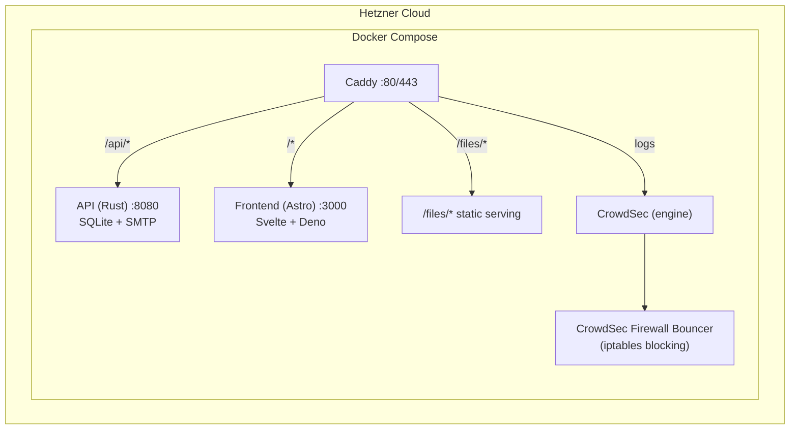

# Personal Site

[Live](https://valentinrogg.de)

## Architecture



- **Caddy** — Reverse proxy and static file server. Routes `/api/*` to the Rust backend, `/files/*` to static files, and everything else to the Astro frontend. Handles automatic HTTPS in production.
- **Frontend** — Astro with Svelte components, running on Deno. Server-side rendered.
- **API** — Rust backend with SQLite. Handles contact form (SMTP), signatures, analytics, and Friendly Captcha verification.
- **CrowdSec** — Parses Caddy access logs to detect malicious traffic. The firewall bouncer applies iptables bans.
- **Terraform** — Provisions the Hetzner Cloud server, SSH keys, and firewall rules.

## Setup

```bash
cp .env.example .env
# Edit .env with your values
```

## Developing

### Option 1: HMR Development (recommended for frontend work)

Runs only the API + Caddy in Docker, frontend runs locally with hot reload:

```bash
docker compose -f docker-compose.dev.yml up -d --build
cd frontend && deno task dev
```

Access: http://localhost:8080

### Option 2: Full Docker (no HMR, self-contained)

Runs everything in Docker, mirrors production:

```bash
docker compose -f docker-compose.local.yml up -d --build
```

Access: http://localhost:8080

## Production

```bash
docker compose up -d --build
```

Uses `docker-compose.yml` with automatic HTTPS via Caddy, CrowdSec security engine, and firewall bouncer.

## Infrastructure

```bash
cd terraform
cp terraform.tfvars.example terraform.tfvars
# Edit terraform.tfvars with your Hetzner token and SSH key
terraform init && terraform apply
```

## Linting & Formatting

```bash
deno task format
deno task lint
```
